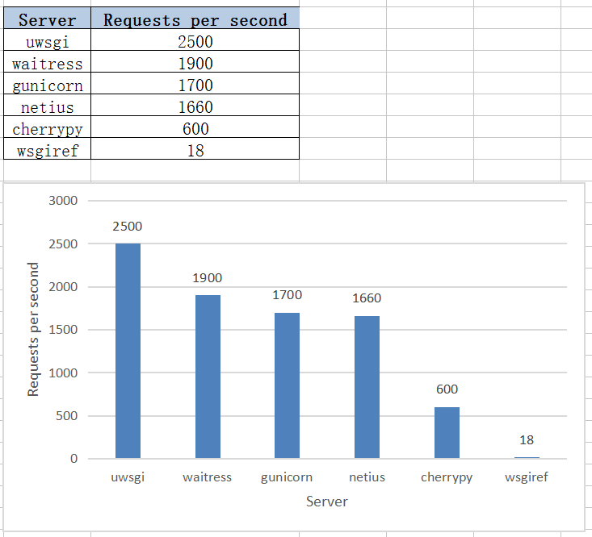

WSGI Server Performance Tests 
 
Testing Environment  
----------------------------------------------------------  
2 vagrant ubuntu/trusty64 servers  
55.55.55.5: wsgi server host  
55.55.55.6: testing host  
 
Testing Command  
----------------------------------------------------------  
ab -n 500 -c 50 "http://55.55.55.5:8081/"  
 
Results  
----------------------------------------------------------  
